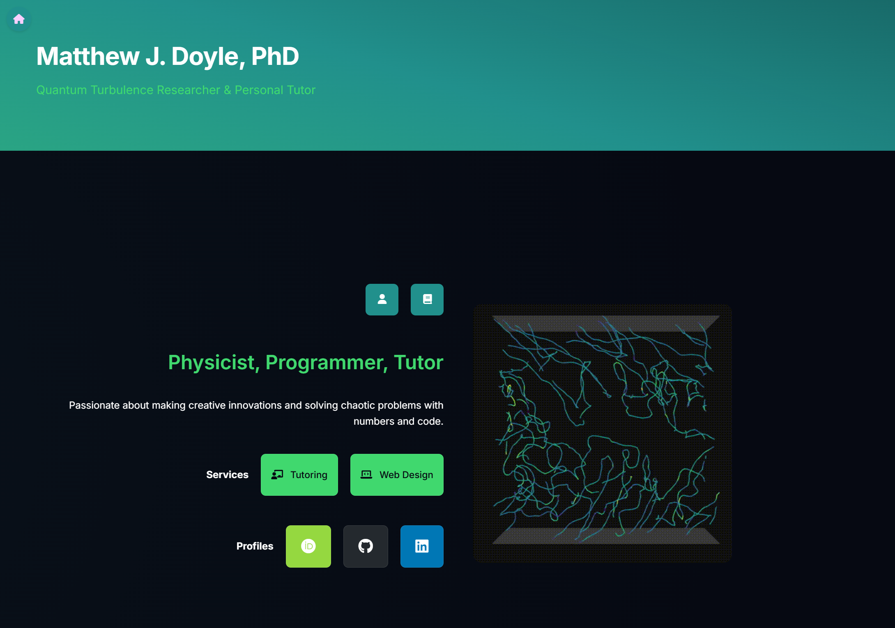

# Matthew J. Doyle // My Website

A personal website showcasing my professional background, academic research, tutoring services, and web design services.

The site is hosted on GitHub Pages at [matthewjdoyle.github.io](https://matthewjdoyle.github.io)

## Overview

This repository contains the source code for my personal website, which serves as a professional portfolio and service platform. The website highlights my experience as a quantum turbulence researcher, my offerings as a personal tutor in physics, mathematics, and coding, and my web design services for individuals and businesses.

## Features

- **Responsive Design**: Fully responsive layout that adapts to various screen sizes and devices
- **Modern UI**: Clean, professional interface with smooth animations and transitions
- **Interactive Timeline**: Visual representation of my academic and professional journey
- **Service Sections**: Dedicated pages for tutoring and web design services with intergrated equiry forms
- **Publication Portfolio**: Comprehensive list of my academic publications and research work
- **Quantum Turbulence Visualisations**: Animations of my quantum vortex research

## Site Structure

- **Home (`/`)**: Main landing page with overview and navigation
- **About (`/about`)**: Personal background, interactive timeline, and qualifications
- **Tutoring Services (`/tutor`)**: Information about tutoring offerings and booking
- **Web Design (`/webdesign`)**: Portfolio and services for web development
- **Publications (`/publications`)**: Academic papers and research work
- **Credentials (`/credentials`)**: Qualifications and CV

## Technologies Used

- **HTML5**: Semantic markup for content structure
- **CSS3**: Custom styling with CSS variables for theming
- **JavaScript**: Interactive elements and animations
- **Intersection Observer API**: For scroll-based animations
- **Font Awesome**: Icon library for visual elements
- **GitHub Pages**: Hosting platform

## Contact

For inquiries about the website or services offered:
- Email: enquire.matthewjdoyle@gmail.com
- LinkedIn: [matthewd0yle](https://www.linkedin.com/in/matthewd0yle)
- GitHub: [matthewjdoyle](https://github.com/matthewjdoyle)
- [matthewjdoyle.github.io](https://matthewjdoyle.github.io)
---

© 2025 Matthew J. Doyle. All rights reserved.
